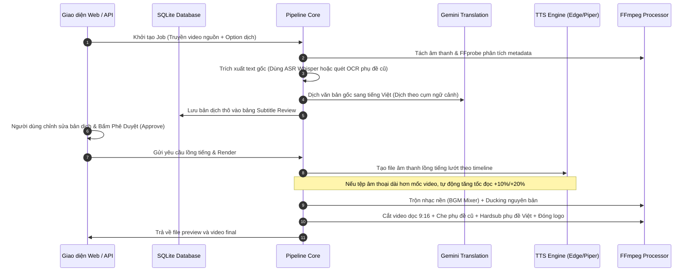
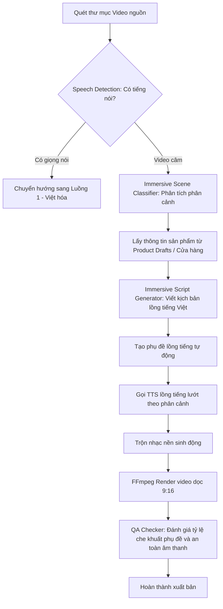

# Hướng Dẫn Tính Năng, Cách Dùng và Luồng Xử Lý (Workflows) - Auto Tool

Tài liệu này tổng hợp toàn bộ các tính năng, cách vận hành chi tiết và sơ đồ luồng công việc (workflows) của hệ thống **Auto Tool** dựa trên mã nguồn thực tế thu thập được.

---

## 1. Tổng Quan Các Tính Năng Chính (Features)

Hệ thống cung cấp 3 bộ giải pháp chính chuyên biệt cho video ngắn (9:16) hướng đến các nền tảng TikTok, Facebook Reels, Youtube Shorts:

| Bộ giải pháp | Tính năng chi tiết | Mục đích sử dụng |
| :--- | :--- | :--- |
| **1. Việt hóa Video ngắn (Video Localization)** | - Tách tiếng, ASR (Nhận diện giọng nói sang text). - Quét OCR vùng phụ đề cứng (hỗ trợ phụ đề tiếng Trung Quốc). - Dịch tự động bằng Gemini AI theo ngữ cảnh. - Giao diện Duyệt phụ đề (Subtitle Review). - Sinh giọng lồng tiếng Việt (TTS). - Ghi đè phụ đề Việt hóa, che vùng phụ đề cũ. | Dịch phim, reup phim ngắn, video nước ngoài sang tiếng Việt. |
| **2. Video Câm sang Thuyết minh (Silent Immersive Reup)** | - Phát hiện giọng nói trong video nguồn (Speech Detection). - Tự động phân loại phân cảnh (Hook, Tính năng, Chi tiết, CTA). - Viết kịch bản thuyết minh tự động dựa trên thông số sản phẩm. - Lồng tiếng và tạo phụ đề tự động theo nhịp cảnh. | Chuyển đổi video câm của nhà máy Trung Quốc hoặc slide ảnh tĩnh thành video giới thiệu sản phẩm lồng tiếng Việt cuốn hút. |
| **3. Biên tập hàng loạt & QA (Publishing / Quality Control)** | - Quản lý tài nguyên render song song (Resource Guard). - Quét và đánh giá chất lượng tự động (Final QA). - Tự động sinh Caption, Hashtags và Checklist đăng bài. - Khôi phục tác vụ thông minh khi crash (Crash Recovery). | Hỗ trợ editor vận hành hàng trăm video cùng lúc, giảm thiểu tối đa lỗi kỹ thuật trước khi đăng tải. |

---

## 2. Luồng Công Việc Chi Tiết (Workflows)

### Luồng 1: Quy trình Việt hóa Video Nước ngoài (Video Localization)

Luồng này chuyên dùng để dịch video (ví dụ: video Douyin Trung Quốc) sang video ngắn tiếng Việt hoàn chỉnh.

---

### Luồng 2: Quy trình Xử lý Video Câm (Silent Immersive Reup)

Luồng này chuyên dùng để sản xuất hàng loạt video bán hàng từ video câm/review thô không có tiếng nói.

---

## 3. Hướng Dẫn Sử Dụng Chi Tiết (How to Use)

### Bước 1: Khởi động công cụ
Bạn có hai cách để khởi động giao diện điều khiển (Frontend React + FastAPI backend):
1.  **Dùng Launcher (Đề xuất trên Windows)**: 
    *   Mở thư mục ứng dụng và click đúp vào file `launcher/start_auto_tool_studio.bat`.
    *   Hệ thống sẽ chạy kiểm tra môi trường, khởi động cổng `8000` và tự động mở trình duyệt tại địa chỉ `http://127.0.0.1:8000`.
2.  **Chạy qua Script**:
    *   Mở terminal trong thư mục dự án và chạy: `scripts\start_local_prod.bat`.

---

### Bước 2: Cấu hình Hệ thống
Truy cập vào giao diện web mục **Settings** (Cài đặt) để thiết lập:
*   **API Keys**: Điền Gemini API Key để thực hiện dịch thuật và viết kịch bản AI.
*   **Công cụ offline (Nếu cần thiết)**: Nếu sử dụng TTS offline, đảm bảo bạn đã tải Piper TTS model. Hệ thống sẽ tự động tải các gói này thông qua `DependencyManager` ở lần chạy đầu tiên.
*   **Thư mục mặc định**: Thiết lập thư mục nguồn (`default_source_folder`) và thư mục chứa video hoàn thành (`default_output_folder`).

---

### Bước 3: Quy trình Thực hiện Một Dự Án Mẫu

#### 1. Nhập thông tin sản phẩm (Nháp - Product Draft)
*   Vào mục **Product Drafts**, bạn có thể tạo thủ công hoặc import link sản phẩm (như Shopee, TikTok Shop) thông qua extension.
*   Hệ thống sẽ chuẩn hóa dữ liệu sản phẩm bao gồm tên, tính năng nổi bật, thông số kỹ thuật.

#### 2. Import Video và Phân tích
*   Chọn **Create Project**, chọn thư mục chứa các video thô.
*   Nhấn **Scan Media**, hệ thống tự động đo thời lượng, góc quay (ngang/dọc) và phân tích phụ đề Trung Quốc có sẵn trên màn hình.

#### 3. Chỉnh sửa và Dịch phụ đề
*   Hệ thống tự động dịch và phân đoạn video. Bạn vào giao diện **Subtitle Review** để xem bản dịch tiếng Việt tương ứng từng mốc thời gian.
*   *Lưu ý thẩm mỹ*: Bạn có thể sửa câu dịch cho ngắn gọn hơn để không bị tràn dòng chữ. Nếu câu dịch quá dài, hệ thống sẽ cảnh báo đỏ (cảnh báo nguy cơ không khớp khẩu hình video).

#### 4. Lựa chọn Phong cách thẩm mỹ (Visual Style Presets)
Hệ thống cung cấp các Preset được cấu hình sẵn theo ngành hàng hoặc chủ đề tại giao diện **Render Settings**:
*   **Che phụ đề cũ (Subtitle Cover)**:
    *   Bật tính năng `subtitle_mask` để che vùng phụ đề cũ.
    *   Lựa chọn chế độ mask phù hợp: `bottom_box` (hộp đen mờ dưới cùng) hoặc tạo dải mờ.
*   **Subtitle Style (Hardsub)**:
    *   Chọn font chữ mong muốn (khuyên dùng Arial, Outfit, Inter,...).
    *   Thiết lập kích cỡ chữ (`font_size`), viền chữ (`stroke` chống lóa nền) và đổ bóng (`shadow`).
*   **Crop hình ảnh**: Nếu video gốc dạng ngang (16:9), chọn `blurred_bg` để tạo hiệu ứng nền mờ sang dọc (9:16) mà không bị méo hình.

#### 5. Chọn Giọng đọc lồng tiếng (TTS Settings)
*   Chọn nhà cung cấp giọng đọc lồng tiếng (ví dụ: `edge_tts` hoặc `piper`).
*   Chọn nhân vật đọc (đối với tiếng Việt khuyên dùng giọng nam/nữ miền Nam hoặc miền Bắc của Edge-TTS để tạo độ chân thực cao).
*   Chèn nhạc nền phù hợp với thể loại sản phẩm (funny, upbeat, chill,...) từ kho nhạc `examples/music`.

#### 6. Chạy render và Đăng tải
*   Bấm **Start Render**. Bạn có thể theo dõi tiến độ thời gian thực ở hàng đợi Render Queue.
*   Hệ thống tự động chạy qua 8 bước pipeline (Từ tách âm thanh -> Dịch -> TTS -> Ghép BGM -> Render FFmpeg -> Đánh giá QA).
*   Video hoàn thành sẽ nằm trong thư mục `examples/outputs`. Bên cạnh video, hệ thống tự động xuất tệp `caption.txt` chứa tiêu đề viết sẵn, hashtags và một tệp checklist công việc sẵn sàng để bạn copy và đăng tải.

---

### Bước 4: Khôi phục khi gặp sự cố (Crash Recovery)
*   Nếu máy tính bị sập nguồn hoặc tắt ứng dụng giữa chừng, lần khởi động sau bạn hãy mở đường dẫn `http://127.0.0.1:8000/recovery`.
*   **Recovery Center** sẽ hiển thị các job bị gián đoạn. Bạn có thể chọn **Resume** để hệ thống chạy tiếp từ bước cuối cùng lưu trên SQLite mà không phải render lại từ đầu, giúp tiết kiệm thời gian tối đa.
