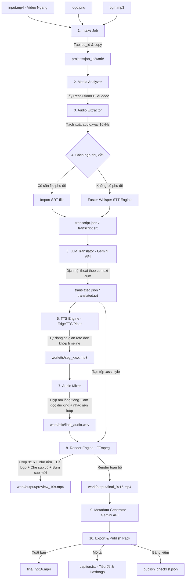

# Luồng Triển Khai Hệ Thống (Implementation Workflow)
## AI Video Localization & Short-form Publisher

Tài liệu này đặc tả **toàn bộ quy trình thiết kế, cấu trúc thư mục, luồng dữ liệu chi tiết và các bước triển khai kỹ thuật** để xây dựng ứng dụng dựa trên tài liệu yêu cầu chức năng (REQ) từ file [IDEA.docx](file:///c:/Users/XinWei/Downloads/AutoTool-v1.0.54-windows/AutoTool/IDEA.docx).

---

## 1. Kiến Trúc Thư Mục Đề Xuất (Directory Structure)

Dự án được tổ chức theo mô hình dịch vụ chia lớp (Service-Provider Pattern) giúp dễ dàng mở rộng và bảo trì:

```text
app/
├── main.py                       # CLI Entry Point (Typer CLI: process, preview, retry, export)
├── config.py                     # Quản lý cấu hình, biến môi trường (Pydantic Settings)
├── requirements.txt              # Khai báo thư viện (ffmpeg-python, edge-tts, pydantic, pysrt, pydub, faster-whisper)
├── README.md                     # Hướng dẫn cài đặt và vận hành nhanh
│
├── core/                         # Thành phần cốt lõi của hệ thống
│   ├── pipeline.py               # Quản lý luồng xử lý tuần tự qua các step
│   ├── job_runner.py             # Thực thi hàng đợi (Queue) và đa luồng
│   ├── logger.py                 # Thiết lập hệ thống ghi log luồng công việc
│   ├── paths.py                  # Định nghĩa và chuẩn hóa đường dẫn thư mục
│   └── errors.py                 # Khai báo các Custom Exceptions của hệ thống
│
├── models/                       # Data Models (Pydantic / Dataclasses)
│   ├── job.py                    # Schema lưu trữ trạng thái Job
│   └── segment.py                # Schema lưu trữ mốc phụ đề/âm thoại từng câu
│
├── storage/                      # Lớp tương tác lưu trữ dữ liệu
│   ├── json_store.py             # Lưu trạng thái dạng file JSON nguyên tử (Atomic Write)
│   └── sqlite_store.py           # Quản lý database SQLite (cho Phase 2 rộng hơn)
│
├── services/                     # Lớp dịch vụ nghiệp vụ chính
│   ├── asset_service.py          # Quản lý tải và nạp file đầu vào (logo, video, nhạc)
│   ├── media_analyzer.py         # Phân tích thông tin media bằng FFprobe
│   ├── audio_extractor.py        # Tách và chuẩn hóa kênh âm thanh (WAV 16kHz mono)
│   ├── stt_service.py            # Nhận diện giọng nói gốc thành text (ASR)
│   ├── translation_service.py    # Dịch thuật thông minh theo cụm hội thoại
│   ├── tts_service.py            # Tạo giọng đọc khớp thời lượng từng phân đoạn
│   ├── subtitle_service.py       # Quản lý tệp phụ đề (SRT, ASS, an toàn safe-zone)
│   ├── brand_overlay_service.py  # Xử lý đóng dấu logo thương hiệu
│   ├── bgm_service.py            # Quản lý lặp và ghép nhạc nền (BGM)
│   ├── audio_mixer.py            # Hợp âm lồng tiếng + âm gốc + nhạc nền (Ducking)
│   ├── render_service.py         # Engine kết xuất FFmpeg (Crop, blur, hardsub, overlay)
│   └── metadata_service.py       # Tự động sinh Caption, Hashtags hỗ trợ đăng bài
│
├── providers/                    # Các nhà cung cấp dịch vụ ngoài (qua Interface)
│   ├── stt_base.py               # Interface định nghĩa dịch vụ nhận diện giọng nói
│   ├── whisper_provider.py       # Triển khai STT sử dụng local Faster-Whisper
│   ├── tts_base.py               # Interface định nghĩa dịch vụ sinh giọng nói
│   ├── edge_tts_provider.py      # Triển khai Edge TTS (Free, Online)
│   ├── piper_tts_provider.py     # Triển khai Piper TTS (Offline, Local)
│   ├── translate_base.py         # Interface định nghĩa dịch vụ dịch thuật
│   └── llm_translate_provider.py # Triển khai dịch thuật sử dụng Gemini API
│
├── presets/                      # Lưu trữ các file cấu hình mặc định (JSON)
│   ├── subtitle_presets.json     # Cấu hình thẩm mỹ phụ đề mặc định
│   ├── emotion_presets.json      # Cấu hình giọng đọc cảm xúc (giả lập qua rate/pitch)
│   └── render_presets.json       # Cấu hình tỷ lệ scale và bộ lọc video FFmpeg
│
└── tests/                        # Hệ thống Unit Test kiểm thử
    ├── test_srt_parser.py
    ├── test_segment_schema.py
    └── test_job_runner.py
```

---

## 2. Sơ Đồ Luồng Dữ Liệu Chi Tiết (Data Pipeline Flow)

Biểu đồ dưới đây mô tả hành trình biến đổi của dữ liệu từ khi người dùng cung cấp video ngang gốc cho đến khi render ra video dọc 9:16 hoàn chỉnh tiếng Việt:



---

## 3. Quy Trình 10 Bước Triển Khai Kỹ Thuật (Implementation Steps)

### Bước 1: Khởi dựng Khung Dự án (Scaffold Setup)
1.  Tạo cấu trúc cây thư mục như mục 1.
2.  Tạo tệp `requirements.txt` chứa các gói cần thiết:
    ```text
    ffmpeg-python>=0.2.0
    edge-tts>=6.1.3
    pydantic>=2.0.0
    typer>=0.9.0
    rich>=13.0.0
    pysrt>=1.1.2
    pydub>=0.25.1
    faster-whisper>=0.10.0
    google-genai>=0.1.0
    ```
3.  Tạo tệp `main.py` khai báo CLI bằng `Typer` với 4 câu lệnh cơ bản:
    *   `python main.py process --input <path>` (Chạy toàn bộ pipeline)
    *   `python main.py preview --job-id <id> --seconds 10` (Render thử 10 giây đầu)
    *   `python main.py retry --job-id <id> --from-step <step>` (Chạy lại từ bước lỗi)
    *   `python main.py export --job-id <id>` (Đóng gói kết quả đầu ra)

### Bước 2: Thiết kế Data Models
1.  Tạo lớp `Segment` (`models/segment.py`) lưu thông tin mốc phụ đề:
    *   `id`: Số thứ tự.
    *   `start_ms` & `end_ms`: Thời gian bắt đầu và kết thúc (milisecond).
    *   `speaker`: Tên nhân vật nói.
    *   `source_text`: Câu thoại gốc.
    *   `translated_text`: Câu thoại dịch tiếng Việt để hiển thị phụ đề.
    *   `tts_text`: Câu thoại rút gọn để đọc TTS khớp thời lượng (nếu câu dịch quá dài).
    *   `tts_path`: Đường dẫn tới file âm thanh đã sinh.
    *   `status`: Trạng thái (`pending`, `tts_generated`, `needs_review`).
2.  Tạo lớp `Job` (`models/job.py`) lưu trạng thái tiến trình xử lý:
    *   `job_id`, `status`, `current_step`, `steps` (dict các bước và trạng thái `done`/`failed`), `errors` (danh sách lỗi).

### Bước 3: Thiết lập Lớp Lưu Trữ (Atomic Storage)
1.  Viết lớp `JsonStore` (`storage/json_store.py`) để đọc ghi tệp `job_state.json`.
2.  **Nguyên tắc ghi an toàn (Atomic Write)**: Tránh mất mát dữ liệu khi crash:
    *   Khi lưu dữ liệu, ghi thông tin vào tệp tạm thời `job_state.json.tmp`.
    *   Sau khi ghi thành công, thực hiện đổi tên (rename) đè lên tệp chính `job_state.json`.

### Bước 4: Xây dựng Media Services (FFmpeg / FFprobe)
1.  Viết lớp `MediaAnalyzer` (`services/media_analyzer.py`) dùng `FFprobe` để đọc thông số của video đầu vào (Resolution, FPS, Codec, Audio channel).
2.  Viết lớp `AudioExtractor` (`services/audio_extractor.py`) thực thi FFmpeg lệnh trích xuất:
    ```bash
    ffmpeg -i input.mp4 -vn -acodec pcm_s16le -ar 16000 -ac 1 work/audio.wav
    ```

### Bước 5: Xây dựng Module Subtitle & ASR
1.  Viết parser để import tệp phụ đề `.srt` hoặc `.vtt` chuyển đổi thành các thực thể `Segment`.
2.  Tích hợp `Faster-Whisper` (Local) trong `WhisperProvider` thực hiện quét và tự động tạo phụ đề có timestamp nếu không có tệp phụ đề cung cấp sẵn.
3.  Xây dựng lớp `SubtitleService` để tự động ngắt câu phụ đề quá dài (split câu dài hơn 8s) hoặc gộp câu quá ngắn (dưới 500ms).

### Bước 6: Tích hợp Translation Service (Gemini API)
1.  Định nghĩa `TranslationProvider` interface.
2.  Xây dựng `LLMTranslationProvider` giao tiếp với Gemini API.
3.  Viết prompt dịch thuật theo cụm (Context window): Gom từ 10-30 câu thoại gửi lên AI cùng lúc kèm thông tin nhân vật (`speaker`) và bảng thuật ngữ (`glossary`) để dịch chuẩn văn phong (như Review phim, hài hước, drama...).
4.  Yêu cầu mô hình AI trả về cấu trúc JSON chứa cặp `"translated_text"` và `"tts_text"` (rút gọn của câu dịch nếu câu dịch có độ dài ký tự lớn vượt quá thời lượng segment gốc).

### Bước 7: Xây dựng Engine Lồng Tiếng (TTS Service)
1.  Định nghĩa `TTSProvider` interface.
2.  Xây dựng `EdgeTTSProvider` dùng thư viện `edge-tts` (gọi API Microsoft Edge miễn phí).
3.  Xây dựng cơ chế co giãn tốc độ (Timing Lock):
    *   Sau khi sinh file thoại `.mp3` cho mỗi câu, đo độ dài tệp âm thanh thu được.
    *   So sánh độ dài âm thanh với thời lượng thực tế của segment (`end_ms - start_ms`).
    *   Nếu thời lượng âm thanh lớn hơn mốc segment: Gọi FFmpeg tăng tốc độ đọc của tệp âm thoại lên +10% hoặc +20%. Nếu vẫn không kịp thời gian, đánh dấu trạng thái `needs_review` để người dùng sửa lại chữ.

### Bước 8: Trộn âm thanh (Audio Mixer)
1.  Xây dựng `AudioMixer` thực thi lệnh trộn bằng FFmpeg `filter_complex`:
    *   Đặt các đoạn thoại lồng tiếng vào đúng mốc thời gian `start_ms`.
    *   Đặt nhạc nền (BGM) chạy lặp (loop) từ đầu đến cuối video.
    *   **Cơ chế Ducking (Giảm nhạc nền khi nói)**: Khi phát hiện mốc thời gian có giọng đọc TTS, âm lượng của âm thanh gốc và nhạc nền tự động giảm xuống còn 10% - 20%, sau khi giọng TTS kết thúc thì âm lượng nhạc nền tự động nâng lên trạng thái bình thường.

### Bước 9: Trình Render Video (FFmpeg Render)
1.  Xây dựng bộ lọc render video hoàn chỉnh tùy biến theo cấu hình `render_presets.json`:
    *   **Crop tỷ lệ dọc**: Scale và crop video gốc sang 1080x1920. Nếu chọn chế độ nền mờ (`blurred_bg`), thực hiện nhân bản luồng video, luồng 1 scale mờ làm nền, luồng 2 giữ nguyên tỷ lệ đè lên giữa.
    *   **Hộp đen che sub cũ (Subtitle Mask)**: Vẽ một hình chữ nhật đen mờ (opacity 85%) che vùng phụ đề gốc bên dưới.
    *   **Đóng logo**: Overlay hình ảnh logo thương hiệu lên góc màn hình (mặc định Top Right, size 12%).
    *   **Burn sub mới**: Hardsub phụ đề Việt hóa (đọc từ tệp `.ass` đã được định dạng font, cỡ chữ, safe-zone tránh vùng che khuất của giao diện TikTok).
    *   **Chèn Audio**: Khóa âm thanh gốc của video, ghép file mix âm thanh hoàn chỉnh (`final_audio.wav`) đã xử lý ở Bước 8.

### Bước 10: Viết Unit Test và Kiểm thử Hệ thống
1.  Viết các ca kiểm thử tự động (Unit test) trong thư mục `tests/`:
    *   Kiểm tra tính đúng đắn khi parse tệp SRT.
    *   Kiểm tra cơ chế ghi file nguyên tử của `JsonStore`.
    *   Chạy pipeline giả lập (Mocking AI translation và Mocking TTS) để kiểm định luồng chạy tuần tự của `PipelineRunner`.
2.  Sau khi kiểm định thành công, tiến hành đóng gói ứng dụng bằng PyInstaller để tạo sản phẩm phân phối.
